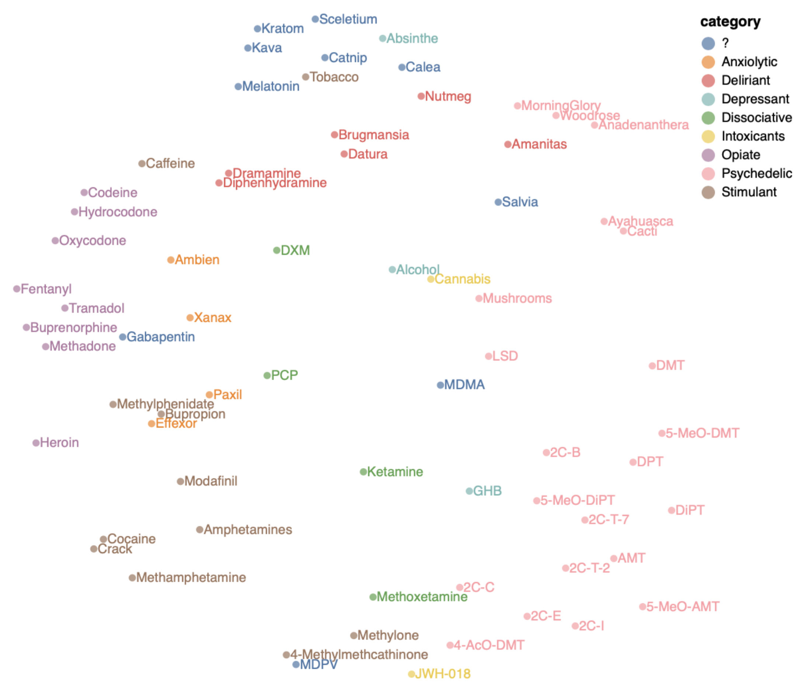

# What Drug Was That?

What Drug Was That is a web app that displays an analysis of how patterns in verbal reports of drug experiences; it also classifies novel texts, showing what kind of drug induces reports similar to the novel text.

## How?

Drug reports were collected on the internet. Files were processed in Python (with [Beautiful Soup](https://www.crummy.com/software/BeautifulSoup/bs4/doc/) to take care of HTML). With[ Scikit-Learn](https://github.com/scikit-learn/scikit-learn), [FastText](http://fasttext.cc/) classifiers were trained to predict the drugs taken during an experience, based on the text itself. First, a model was run excluding all modality-specific words and drug names; for example, words like "needle", "Cannabis" and "joint" were excluded. This was done so that the model picked up on the experience itself, not on the physical substance (or the mode of consumption). The output layer of the model - i.e., an embedding of drugs - was dimensionality reduced via TSNE, and displayed with [Matplotlib](matplotlib.org) and [Altair](https://altair-viz.github.io). Then, the (cross-validation based) confusion matrix was calculated, and likewise displayed.
Next, a second model was trained, without excluding words relating to the physical substrate. This second model was packaged into an [AWS](aws.amazon.com)-compatible Lambda format, and made available online.

The visualisation was embedded into a website with [Flask](http://flask.pocoo.org/); Flask also controls a text input box, and relays the text to the FastText Lambda (which returns the predicted substances). This site was [docker](https://www.docker.com)ized and deployed online via AWS Elastic Beanstalk, available [here](http://WhatDrugWasThat.eu-central-1.elasticbeanstalk.com).

## Why?

To check if verbal/subjective experiences of drugs pattern isomorphically to the chemical form of drugs. They do.

## Acknowledgements

Peer Herholz provided invaluable assistance for the visualisation and dockerization.
